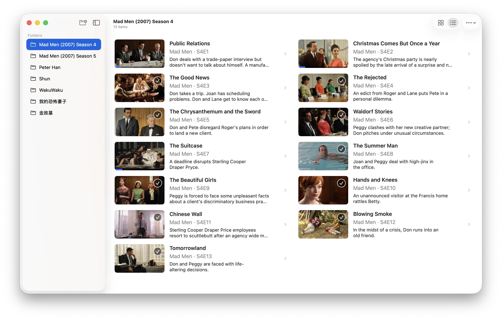

# Owl

Owl is a native SwiftUI macOS video player built on `libmpv`. It targets
macOS 14 or newer on Apple silicon. Releases bundle their own copies of
`libmpv` and `ffmpeg`, so the downloaded app needs no Homebrew install to run.



## Download

Grab the signed, notarized DMG from [GitHub
Releases](https://github.com/limboy/owl/releases/latest) — no Homebrew
or other setup needed. The app checks for updates on its own via Sparkle; see
[Distribution note](#distribution-note).

Owl was called MVPlayer before 0.3.0, and it installs alongside an existing
MVPlayer rather than replacing it: delete the old app by hand. To carry the
library and playback progress over, move
`~/Library/Application Support/MVPlayer` to
`~/Library/Application Support/Owl` before first launch.

## Features

- A folder-based library: drop folders in or add them from the browser header,
  and they are remembered and watched for filesystem changes.
- Single files opened in a window of their own, from the File menu, the Finder,
  or a drop on the browser, leaving the folder window's queue untouched.
- Playback progress kept per file and shared by every window, so a part-watched
  video resumes on the frame it left off at.
- Timeline scrubbing with hover frame previews for every playable format,
  shaped like the video they preview — AVFoundation where it can read the file,
  bundled `ffmpeg` or `mpv` for the containers it cannot, such as MKV, AVI,
  and WebM.
- A status bar under the list describing the selection: running time,
  dimensions, frame rate, and file size for a video, the location for a folder.
- Embedded subtitle and audio track selection, plus external subtitle loading.
- Queue controls with previous, next, shuffle, repeat all, and repeat one, and
  a queue that advances on its own when a file plays to its end.
- Playback speed presets from 0.5x to 2x.
- Optional metadata sync, switched on per library from the browser's ellipsis
  menu: videos are matched against The Movie Database by file name and take on
  the work's title, description, and artwork. Off by default, and only
  available in builds carrying an API key — see [Metadata
  sync](#metadata-sync).
- Full-screen playback, with the controls and the pointer both hiding after a
  moment of stillness, plus macOS Now Playing information and media-key and
  remote playback controls.
- Broad local video support through `libmpv`, hardware accelerated where
  supported: MP4, MKV, MOV, AVI, WebM, MPEG, M2TS, FLV, WMV, and the rest of
  what mpv handles.

Owl provides its own playback interface and disables mpv's built-in Lua
overlays and online-video hooks. It is designed for local video playback.

## Requirements

- Xcode 26 or newer
- [XcodeGen](https://github.com/yonaskolb/XcodeGen)
- Homebrew mpv and ffmpeg, needed on the *build* machine only:

  ```sh
  brew install mpv ffmpeg
  ```

A Release build vendors `libmpv` and the `ffmpeg`/`ffprobe` binaries (plus
every Homebrew dylib either depends on) into the app bundle — see
[Bundled runtime](#bundled-runtime) — so the built app plays back without
Homebrew on the machine that runs it. A plain debug build skipped past that
step still loads libmpv from `/opt/homebrew` at runtime, falling back to a
setup screen instead of failing at launch if it is unavailable, and scrubber
previews fall back the same way to a Homebrew `ffmpeg`, then a Homebrew `mpv`
binary. Set `OWL_LIBMPV_PATH`, `OWL_FFMPEG_PATH`, or
`OWL_MPV_PATH` to point any of these at an installation elsewhere.
Without any of them, playback is unavailable and previews and metadata are
limited to files AVFoundation can decode.

## Bundled runtime

Owl links against `libmpv` and shells out to `ffmpeg`/`ffprobe` for
containers AVFoundation cannot read. Rather than requiring end users to
install Homebrew mpv/ffmpeg themselves, a Release build embeds them the way
[IINA](https://github.com/iina/iina) does:

```sh
scripts/bundle-mpv-deps.sh
```

This copies `libmpv.dylib`, `ffmpeg`, `ffprobe`, and every Homebrew dylib any
of them depend on into `deps/lib` and `deps/bin`, rewriting their install
names to `@rpath` so they no longer reference `/opt/homebrew`. `deps/` is
gitignored — regenerate it locally whenever the Homebrew mpv or ffmpeg
version changes, and before packaging a release. The `Owl` target's
"Embed mpv runtime" build phase then copies `deps/lib` into
`Contents/Frameworks` and `deps/bin` into `Contents/Resources/bin`, and
code-signs each copy; `CMPVShim` and `ExternalThumbnailRenderer` look there
before ever trying a Homebrew path. If `deps/` is empty the build still
succeeds, it just falls back to Homebrew at runtime as before.

This is also why Owl is GPLv3-licensed rather than MIT — see
[License](#license).

Opening a file starts one background pass that extracts a strip of preview
frames covering the whole timeline, so hovering reads from memory and keeps up
with the pointer. With `ffmpeg` the pass decodes key frames only, which covers
a ten minute file in well under a second; positions it has not reached yet fall
back to extracting a single frame on demand.

## Build

```sh
xcodegen generate
xcodebuild \
  -project Owl.xcodeproj \
  -scheme Owl \
  -destination 'platform=macOS,arch=arm64' \
  build
```

You can also open `Owl.xcodeproj` and run the `Owl` scheme.

## Local optimized Release build

This creates an optimized Apple silicon build for local use. Run
[`scripts/bundle-mpv-deps.sh`](scripts/bundle-mpv-deps.sh) first (see
[Bundled runtime](#bundled-runtime)) so the build embeds `libmpv`/`ffmpeg` and
the built app does not need Homebrew mpv on the Mac that runs it.

```sh
xcodegen generate
./scripts/bundle-mpv-deps.sh
xcodebuild \
  -project Owl.xcodeproj \
  -scheme Owl \
  -configuration Release \
  -destination 'platform=macOS,arch=arm64' \
  -derivedDataPath "$PWD/build" \
  clean build
```

The built app is located at:

```text
build/Build/Products/Release/Owl.app
```

Launch it from the command line with:

```sh
open "build/Build/Products/Release/Owl.app"
```

## Usage

- Add one or more folders with the `+` (`Add Folder`) button in the browser
  header, or drag them into the lower browser.
- Use File ▸ Open File… to watch a single file. It opens in a window of its
  own, playing only that file, so the folder window keeps its queue and its
  place in it. Opening a video from the Finder, or dropping one on the browser,
  does the same. Only one window plays at a time: starting a video pauses
  whichever window was playing, where it had got to.
- Click folders to navigate, and use the back button to return.
- Click a video to select it and begin playback automatically.
- Move the selection with the arrow keys to read a folder: the status bar under
  the list follows the selection, not the file being played.
- Use the subtitle menu to select an embedded track, turn subtitles off, or
  load an external subtitle.
- Use the audio menu to switch between embedded audio tracks.
- Use the Playback Options (`…`) menu in the browser toolbar to configure
  looping and shuffle, and to switch metadata sync on or off.
- Use the playback speed menu in the controls to change playback speed.

Added folders are remembered and monitored for filesystem changes. The queue is
made from the immediate video files in the folder where playback was started.

## Metadata sync

Owl can look up what a video is, rather than only what it contains. With
`Sync Metadata` switched on in the browser's Playback Options (`…`) menu, the
videos in the folder being browsed are matched against
[The Movie Database](https://www.themoviedb.org) by file name, and a match
replaces the row's file name with the work's title, adds its description, and
draws its artwork in place of a frame pulled out of the file.

The switch is off by default: looking a folder up means sending the names of
the files in it to a third party, which is not something to start doing on
somebody's behalf. Answers — including "nothing matched" — are cached on disk
per file, so a folder that has been looked at once costs nothing to browse
again, and the switch only affects the browser: playback, progress, and
everything Owl reads out of the files themselves are unchanged.

Matching is done on file names, so `The.Expanse.S01E02.1080p.WEB-DL.mkv` and
`Arrival (2016).mkv` are found, while a file called `video1.mp4` is not. A file
named only for its episode number takes the show's name from the folder holding
it.

### Supplying a key

The Movie Database issues an API key per application. A build carries one baked
into its bundle from the `TMDB_API_KEY` build setting; where there is none, the
switch is shown disabled and everything else works as before.

Put the key in `.env` and generate the local build configuration once:

```sh
echo 'TMDB_API_KEY=<your key>' >> .env
scripts/write-local-config.sh
```

That writes `Owl/Support/Local.xcconfig`, which `Owl/Support/Owl.xcconfig`
includes and which git ignores. Everything that builds from the working copy
then picks the key up — a plain `xcodebuild`, the Run button in Xcode, and
`skills/install-to-local`, which regenerates the file itself before building.
Re-run the script after changing the key. The setting deliberately lives in an
xcconfig rather than in `project.yml`: a target build setting would sit above
the file and override it, and `project.yml` is committed where the key must not
be.

`scripts/release.sh` reads `TMDB_API_KEY` from `.env` and passes it to
`xcodebuild` directly, and the release workflow reads it from the
`TMDB_API_KEY` repository secret; both treat it as optional, so a fork with no
key still builds and releases.

`OWL_TMDB_API_KEY` overrides the bundled key at runtime, in the same way
`OWL_LIBMPV_PATH` and its neighbours override the vendored runtime. It is read
from the running app's environment, so putting it in `.env` has no effect —
set it as an environment variable in the Xcode scheme, or launch the binary
from a shell that exports it.

## Keyboard shortcuts

| Shortcut | Action |
| --- | --- |
| `Space` | Play or pause |
| `Left Arrow` | Seek backward 5 seconds |
| `Right Arrow` | Seek forward 5 seconds |
| `Up Arrow` | Increase volume by 5% |
| `Down Arrow` | Decrease volume by 5% |
| `F` | Toggle full screen |
| `Control-Command-F` | Toggle full screen using the macOS convention |

## Distribution note

A Release build embeds and code-signs its own copies of `libmpv`/`ffmpeg`
(see [Bundled runtime](#bundled-runtime)), so it runs without Homebrew. The
app still disables library validation so the `OWL_*_PATH` overrides and
the Homebrew fallback path keep working for development.

Tagged releases are signed with a Developer ID certificate and notarized by
Apple, then published as a DMG on [GitHub
Releases](https://github.com/limboy/owl/releases) — GPLv3 and Developer
ID notarization are compatible even though Mac App Store distribution isn't
attempted, the same approach [IINA](https://github.com/iina/iina) uses. The
app checks that feed for updates automatically (or on demand from the
Owl menu's "Check for Updates…" item) using
[Sparkle](https://sparkle-project.org).

## Releasing

`scripts/release.sh` builds, vendors `libmpv`/`ffmpeg`, signs, notarizes,
tags, and publishes a GitHub Release from your own Mac; see
[`.env.example`](.env.example) for the required Apple credentials. Pushing a
`vX.Y.Z` tag also runs [`.github/workflows/release.yml`](.github/workflows/release.yml),
which does the same thing in CI from repository secrets. Both scripts pull
release notes from [`CHANGELOG.md`](CHANGELOG.md), so add an entry there
before releasing.

## License

Owl is available under the [GNU General Public License v3.0](LICENSE).
It bundles `libmpv`, `ffmpeg`, and their dependencies, several of which are
GPL-licensed themselves (ffmpeg is built with `--enable-gpl` for `libx264`
and `libx265`); distributing those binaries requires the whole app to be
GPL-licensed too, the same reasoning [IINA](https://github.com/iina/iina)
uses for its own GPLv3 license.
