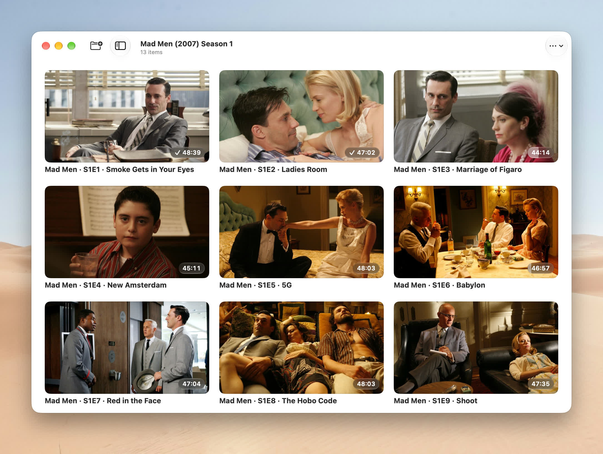
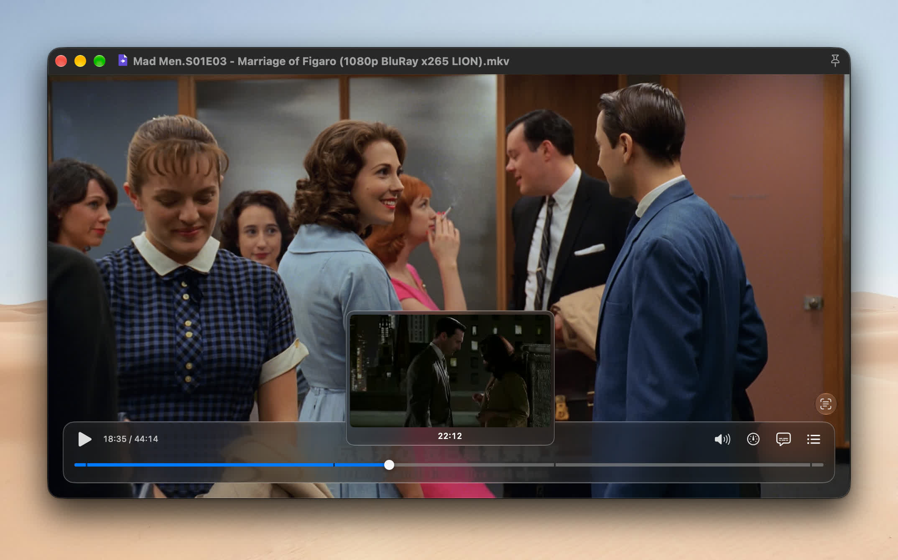

# Owl

A native SwiftUI video player for macOS 26+ on Apple silicon, built on
`libmpv`. It plays nearly anything — MKV, MP4, MOV, AVI, WebM, 4K HDR — with
hardware acceleration, and needs no Homebrew to run.




## Download

Get the signed, notarized DMG from
[GitHub Releases](https://github.com/limboy/owl/releases/latest). Owl updates
itself through [Sparkle](https://sparkle-project.org).

## Features

- **Folder library** — add folders and browse them as a grid of thumbnails;
  they are watched for changes. Search a folder by file name or matched title
  (`⌘F`), and sort it by name, date added, or recently watched.
- **Metadata sync** — optionally match videos against
  [The Movie Database](https://www.themoviedb.org) for titles, descriptions,
  and artwork. Off by default.
- **Resume anywhere** — every file keeps its position and watched state; cards
  show progress at a glance.
- **Player windows** — each video plays in its own window, sized to the video,
  with Liquid Glass controls that hide when you stop moving. Pin a window to
  keep it on top.
- **Timeline previews** — hover the timeline to see frames, in any format.
- **Subtitles that stay put** — embedded or sidecar tracks, Dual Subtitles, and
  per-file track and delay remembered. Sidecar files are found even when
  named for another release.
- **Live Text** — select, copy, and translate text in a paused frame,
  subtitles included.
- **Screenshots** — save the frame at the video's full size to your screenshot
  folder, with or without the subtitles (Playback ▸ Include Subtitles in
  Screenshots).
- Audio track selection, speed from 0.5× to 2×, chapters, Open Recent, Now
  Playing, and media keys.

## Keyboard shortcuts

| Shortcut | Action |
| --- | --- |
| `Space` | Play or pause |
| `←` / `→` | Seek 10 seconds back / forward |
| `↑` / `↓` | Volume up / down 5% |
| `Page Up` / `Page Down` | Previous / next chapter |
| `Z` / `⇧Z` | Subtitles 0.25s earlier / later |
| `J` | Next subtitle track, then off |
| `O` | Show the position |
| `S` | Take a screenshot |
| `⌃⌘F` | Toggle full screen |

## Build

Requires Xcode 26, [XcodeGen](https://github.com/yonaskolb/XcodeGen), and
Homebrew `mpv` and `ffmpeg` on the build machine.

```sh
brew install mpv ffmpeg
xcodegen generate
./scripts/bundle-mpv-deps.sh   # vendor libmpv/ffmpeg into deps/ (optional for debug)
xcodebuild -project Owl.xcodeproj -scheme Owl -configuration Release \
  -destination 'platform=macOS,arch=arm64' -derivedDataPath build build
```

The app lands in `build/Build/Products/Release/Owl.app`. Without `deps/`, a
build loads `libmpv` and `ffmpeg` from Homebrew at runtime; override the paths
with `OWL_LIBMPV_PATH`, `OWL_FFMPEG_PATH`, or `OWL_MPV_PATH`.

To enable metadata sync, add a TMDB key and regenerate the local config:

```sh
echo 'TMDB_API_KEY=<your key>' >> .env
scripts/write-local-config.sh
```

## Releasing

`scripts/release.sh` builds, signs, notarizes, and publishes a GitHub Release
(credentials in [`.env.example`](.env.example)); pushing a `vX.Y.Z` tag does the
same in CI. Release notes come from [`CHANGELOG.md`](CHANGELOG.md).

## License

[GPLv3](LICENSE), because Owl bundles GPL-licensed builds of `libmpv` and
`ffmpeg`.
